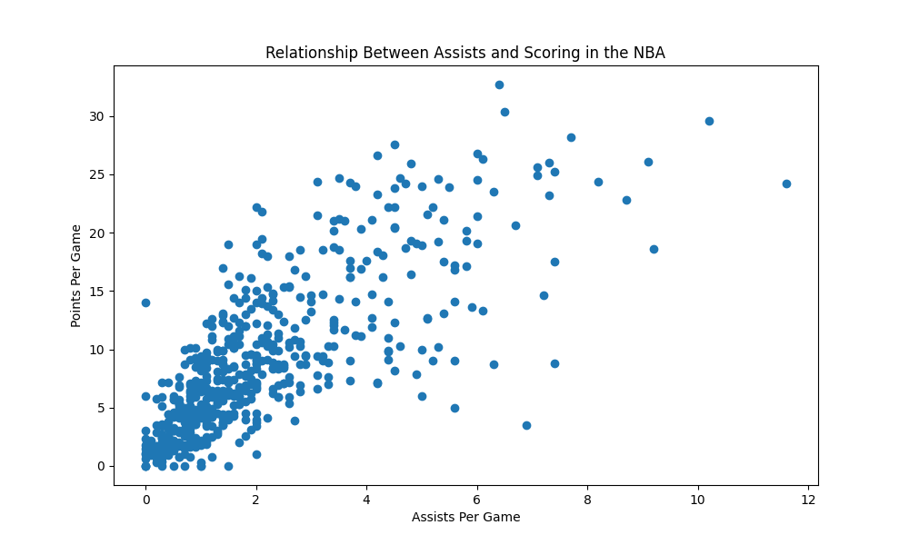

# NBA Player Scoring Analysis

## Project Overview

This project analyzes NBA player statistics from the 2024-25 season to determine which performance metrics are most strongly associated with scoring production. Using Python, Pandas, Matplotlib, and Scikit-learn, I collected player data, performed exploratory data analysis, created visualizations, and built a machine learning model to predict points per game.

## Objectives

* Analyze relationships between NBA player statistics and scoring.
* Identify which metrics are most strongly correlated with points per game.
* Visualize player performance trends.
* Build a regression model to predict scoring output.

## Tools and Libraries

* Python
* Pandas
* Matplotlib
* NumPy
* Scikit-learn
* NBA API

## Data Collection

Player statistics were collected using the NBA API and included:

* Points Per Game (PTS)
* Assists Per Game (AST)
* Rebounds Per Game (REB)
* Field Goal Percentage (FG_PCT)
* Three-Point Percentage (FG3_PCT)
* Free Throw Percentage (FT_PCT)

The dataset contained 569 NBA players from the 2024-25 season.

## Analysis Performed

### 1. Data Cleaning

* Selected relevant player statistics.
* Removed unnecessary columns.
* Prepared the dataset for analysis.

### 2. Correlation Analysis

Calculated correlations between player statistics and points per game.

Results:

| Statistic | Correlation with PTS |
| --------- | -------------------- |
| AST       | 0.771                |
| REB       | 0.632                |
| FT_PCT    | 0.378                |
| FG3_PCT   | 0.303                |
| FG_PCT    | 0.269                |

### 3. Data Visualization

Created visualizations including:

* Top 10 NBA scorers
* Assists vs Points scatter plot
* Trendline analysis

### 4. Machine Learning Model

Built a Linear Regression model using:

* AST
* REB
* FG_PCT
* FG3_PCT
* FT_PCT

to predict points per game.

Model Performance:

R² = 0.701

This indicates that the model explains approximately 70% of the variation in NBA scoring.

## Key Findings

* Assists showed the strongest correlation with scoring (r = 0.771).
* Rebounds were also strongly associated with points per game.
* Three-point percentage was the strongest positive predictor in the regression model.
* Offensive involvement appears to be a major factor in scoring production.

## Conclusion

This project demonstrates the use of data analysis and machine learning techniques to explore NBA player performance. By combining statistical analysis, data visualization, and predictive modeling, the project identified several key metrics associated with scoring output and successfully built a model capable of predicting player scoring performance.

## Future Improvements

* Include advanced statistics such as Usage Rate and True Shooting Percentage.
* Compare multiple machine learning models.
* Analyze player salaries versus performance.
* Expand analysis across multiple NBA seasons.

## How to Run

1. Clone the repository
2. Install required libraries:

pip install pandas matplotlib numpy scikit-learn nba_api

3. Open nba_analysis.ipynb
4. Run all cells
